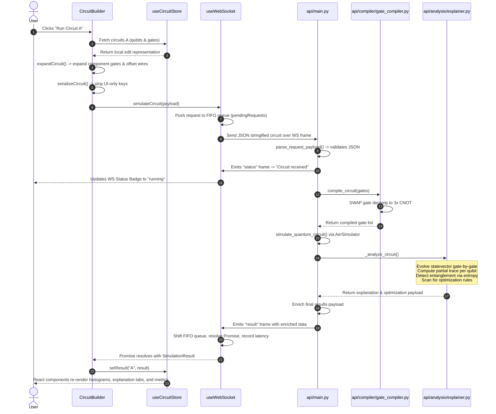

# QHack Working Notes: Engineering-Grade Architecture & Pipeline Reference

This document is the master technical specifications and engineering handbook for the QHack Quantum Lab codebase. It details the mathematical formulations, runtime mechanics, state flow transitions, component models, and data contract specifications across the entire application workspace.

---

## 1. Mathematical and Theoretical Foundations

The simulation and analysis layers of QHack translate quantum mechanics into interactive visualizations. Below are the core mathematical frameworks implemented in the codebase.

### 1.1 Statevector Representation and Unitary Evolution
The quantum register of $n$ qubits is initialized in the ground state:
$$|\psi_0\rangle = |0\rangle^{\otimes n} = \begin{pmatrix} 1 \\ 0 \\ \vdots \\ 0 \end{pmatrix} \in \mathbb{C}^{2^n}$$

Applying a sequence of quantum gates $G_0, G_1, \dots, G_{m-1}$ represents a chain of unitary transformations on the statevector:
$$|\psi_{i}\rangle = \hat{U}(G_i) |\psi_{i-1}\rangle$$
where $\hat{U}(G_i)$ is the $2^n \times 2^n$ unitary matrix corresponding to gate $G_i$, acting on its target (and optional control) qubits, and acts as the identity $\hat{I}$ on all other qubits.
* **Pauli Gates:** 
  $$\hat{X} = \begin{pmatrix} 0 & 1 \\ 1 & 0 \end{pmatrix}, \quad \hat{Y} = \begin{pmatrix} 0 & -i \\ i & 0 \end{pmatrix}, \quad \hat{Z} = \begin{pmatrix} 1 & 0 \\ 0 & -1 \end{pmatrix}$$
* **Hadamard:** 
  $$\hat{H} = \frac{1}{\sqrt{2}}\begin{pmatrix} 1 & 1 \\ 1 & -1 \end{pmatrix}$$
* **Rotation Gates:**
  $$\hat{R}_x(\theta) = \begin{pmatrix} \cos\frac{\theta}{2} & -i\sin\frac{\theta}{2} \\ -i\sin\frac{\theta}{2} & \cos\frac{\theta}{2} \end{pmatrix}, \quad \hat{R}_y(\theta) = \begin{pmatrix} \cos\frac{\theta}{2} & -\sin\frac{\theta}{2} \\ \sin\frac{\theta}{2} & \cos\frac{\theta}{2} \end{pmatrix}, \quad \hat{R}_z(\theta) = \begin{pmatrix} e^{-i\theta/2} & 0 \\ 0 & e^{i\theta/2} \end{pmatrix}$$
* **Phase/T-Gates:**
  $$\hat{S} = \begin{pmatrix} 1 & 0 \\ 0 & i \end{pmatrix}, \quad \hat{T} = \begin{pmatrix} 1 & 0 \\ 0 & e^{i\pi/4} \end{pmatrix}$$

### 1.2 Partial Trace and Bloch Sphere Mapping
To visualize the state of an individual qubit $k$ in an $n$-qubit register, the system must project the joint pure state density matrix $\rho = |\psi\rangle\langle\psi|$ onto a single-qubit subsystem. This is achieved by taking the **Partial Trace** over all qubits except $k$:
$$\rho^{(k)} = \text{Tr}_{\backslash k}(\rho) = \sum_{j} (\langle j|_{\backslash k} \otimes \hat{I}_k) \rho (|j\rangle_{\backslash k} \otimes \hat{I}_k)$$
where $\{|j\rangle_{\backslash k}\}$ is the orthonormal basis for the $2^{n-1}$-dimensional Hilbert space of all qubits except $k$.

The resulting reduced density matrix $\rho^{(k)}$ is a $2 \times 2$ matrix:
$$\rho^{(k)} = \begin{pmatrix} \rho_{00} & \rho_{01} \\ \rho_{10} & \rho_{11} \end{pmatrix}$$
Because $\rho^{(k)}$ is Hermitian and has a trace of $1$, it can be expanded in the basis of Pauli matrices:
$$\rho^{(k)} = \frac{1}{2}(\hat{I} + x\hat{X} + y\hat{Y} + z\hat{Z})$$
This yields the coordinates of the **Bloch Vector** $(x, y, z) \in \mathbb{R}^3$:
$$x = 2\text{Re}(\rho_{01}) = \rho_{01} + \rho_{10}$$
$$y = 2\text{Im}(\rho_{01}) = i(\rho_{01} - \rho_{10})$$
$$z = \rho_{00} - \rho_{11}$$

This calculation is implemented in [quantum.ts](file:///C:/Extra_s/Code/python/QHack/frontend/lib/quantum.ts#L82-L136):
1. For qubit $k$, the mask $2^k$ is used to partition amplitudes into pairs $(a_0, a_1)$ representing basis states ending in $|0\rangle_k$ and $|1\rangle_k$.
2. The elements of the density matrix are accumulated across all $2^{n-1}$ states:
   $$\rho_{00} = \sum |a_0|^2, \quad \rho_{11} = \sum |a_1|^2, \quad \rho_{01} = \sum a_0 a_1^*$$
3. The Bloch coordinates $(x,y,z)$ are computed from these components.

#### 1.2.1 Purity and Mixed States
* **Purity ($P$):**
  $$P = \text{Tr}((\rho^{(k)})^2) = \rho_{00}^2 + \rho_{11}^2 + 2|\rho_{01}|^2 = \frac{1 + x^2 + y^2 + z^2}{2} = \frac{1 + r^2}{2}$$
  where $r = \sqrt{x^2 + y^2 + z^2}$ is the magnitude of the Bloch vector.
* **Interpretation:**
  * If the register is entangled, tracing out the rest of the qubits yields a **mixed state** on qubit $k$. The purity satisfies $P < 1$ ($r < 1$), placing the state vector *inside* the Bloch sphere.
  * If the register is unentangled with respect to qubit $k$, the qubit remains in a **pure state**, satisfying $P = 1$ ($r = 1$), placing the vector on the *surface* of the Bloch sphere.

#### 1.2.2 Bloch Angles
The coordinates are mapped to polar angles:
$$\theta = \arccos(z) \in [0, 180^\circ]$$
$$\phi = \text{atan2}(y, x) \in [0, 360^\circ)$$

#### 1.2.3 SVG 2D Orthographic Projection
To draw the Bloch sphere in [BlochSphere.tsx](file:///C:/Extra_s/Code/python/QHack/frontend/components/BlochSphere.tsx#L22-L27), the 3D coordinates $(x, y, z)$ are projected onto a 2D canvas:
$$x_{\text{proj}} = \text{CENTER} + (x - y \times 0.34) \times \text{RADIUS}$$
$$y_{\text{proj}} = \text{CENTER} - (z + y \times 0.2) \times \text{RADIUS}$$
This project function provides the perspective skew representing depth on the $Y$-axis.

### 1.3 Entanglement Detection via Von Neumann Entropy
In [explainer.py](file:///C:/Extra_s/Code/python/QHack/api/analysis/explainer.py#L623-L639), entanglement is evaluated by calculating the Von Neumann Entropy of the reduced state of individual qubits.
For a density matrix $\rho$, the Von Neumann Entropy $S(\rho)$ is:
$$S(\rho) = -\text{Tr}(\rho \log_2 \rho) = -\sum_{i} \lambda_i \log_2 \lambda_i$$
where $\{\lambda_i\}$ are the eigenvalues of $\rho$.
In QHack, the system traces out all qubits except qubit $A$, computes the eigenvalues of $\rho^{(A)}$, and obtains the entropy $S(\rho^{(A)})$.
* If $S(\rho^{(A)}) > 10^{-6}$ and $S(\rho^{(B)}) > 10^{-6}$, then qubit $A$ and qubit $B$ are flagged as sharing entanglement.
* This operates on the principle that for a pure joint state, a subsystem has non-zero entropy if and only if it is entangled with the remainder of the system.

### 1.4 Bhattacharyya Coefficient for Output Distribution Similarity
When comparing two output probability distributions $P_A$ and $P_B$ from circuits $A$ and $B$, the system computes the Bhattacharyya Coefficient in [explainer.py](file:///C:/Extra_s/Code/python/QHack/api/analysis/explainer.py#L472-L477):
$$BC(P_A, P_B) = \sum_{x \in X} \sqrt{P_A(x) P_B(x)}$$
This overlap metric ranges from $0$ (completely disjoint support) to $1$ (identical probability distributions).

---

## 2. Directory Map and Workspace File Inventory

```
C:\Extra_s\Code\python\QHack
│   .gitignore
│   logo.png
│   README.md                   <-- High-Level Overview and Usage Guide
│   working.md                  <-- Technical Internals (This File)
│
├───api                         <-- FastAPI & Qiskit backend
│   │   __init__.py
│   │   main.py                 <-- WS Endpoint, Dispatch, Sim Loop
│   │   Procfile                <-- Web runner config
│   │   requirements.txt        <-- Dependencies
│   │   runtime.txt             <-- Runtime target (python-3.10)
│   │
│   ├───algorithms              <-- Server-side algorithm builders
│   │       grover.py           <-- Grover generator
│   │       oracle.py           <-- Oracle generator
│   │       qft.py              <-- QFT generator
│   │       registry.py         <-- Backend registration interface
│   │       __init__.py
│   │
│   ├───analysis                <-- Analysis engine
│   │       explainer.py        <-- Stepwise state evaluator, comparison scoring
│   │       __init__.py
│   │
│   ├───compiler                <-- Server-side transpiler
│   │       gate_compiler.py    <-- Gate decomposition (SWAP -> 3 CNOT)
│   │       __init__.py
│   │
│   └───hybrid                  <-- Parameter sweep models
│           variational.py      <-- VQE Ry parameter sweep cost function
│           __init__.py
│
└───frontend                    <-- Next.js Frontend
    │   .env                    <-- Local env pointer
    │   next-env.d.ts
    │   next.config.ts
    │   package.json
    │   postcss.config.js
    │   tailwind.config.ts
    │   tsconfig.json
    │
    ├───app                     <-- Next.js App Router
    │       globals.css         <-- Styling & theme variables
    │       layout.tsx          <-- Document wrapper
    │       page.tsx            <-- Main UI composition
    │
    ├───components              <-- UI Widgets
    │       AlgorithmSelector.tsx <-- Static preset injector
    │       BlochSphere.tsx     <-- SVG Bloch Vector viewer
    │       CircuitBuilder.tsx  <-- Main grid builder, SVG wires, Run logic
    │       CircuitExplainer.tsx  <-- Explainer tabs (Summary, Gates, Optimizations)
    │       CircuitJsonEditor.tsx <-- JSON importer / exporter
    │       ComparisonTable.tsx <-- Local complexity metrics grid
    │       GatePalette.tsx     <-- Sidebar gate configuration
    │       Histogram.tsx       <-- Chart of state occurrences
    │       ThemeProvider.tsx   <-- NextThemes layout provider
    │       ThemeToggle.tsx     <-- Light/Dark switcher
    │       VisualizationPanel.tsx <-- Replay timeline and playback loop
    │       WebSocketStatusBadge.tsx <-- Status and reconnect toggle
    │
    ├───hooks                   <-- React Hooks
    │       useWebSocket.ts     <-- Shared reconnecting socket hook
    │
    ├───lib                     <-- Core utilities and TS definitions
    │       algorithms.json     <-- Preset library database
    │       circuit.ts          <-- Metric calculations, JSON serialization
    │       env.ts              <-- Endpoint URL resolvers
    │       gates.ts            <-- Gate database, theta parsing
    │       mockData.ts         <-- Demo circuits
    │       quantum.ts          <-- Partial trace math
    │       types.ts            <-- Shared TS interface contracts
    │
    └───store                   <-- Zustand Stores
            useCircuitStore.ts  <-- Circuits A/B editing & results store
            useVisualizationStore.ts <-- Step visualization playback store
```

---

## 3. End-to-End System Execution Flow

The system coordinates several steps from user interaction to backend simulation and back.



---

## 4. Backend Architecture: Detailed Code Breakdown

The backend is built with FastAPI, Qiskit, and Qiskit-Aer.

### 4.1 api/main.py
This file acts as the primary runtime coordinator, hosting the WebSocket server and standard HTTP routes.

* **Dependencies and Imports:**
  ```python
  from fastapi import FastAPI, WebSocket, WebSocketDisconnect
  from fastapi.middleware.cors import CORSMiddleware
  from qiskit import QuantumCircuit
  from qiskit_aer import AerSimulator
  ```
  It dynamically resolves imports based on whether it is running as a package or a top-level script, resolving relative modules (`api.analysis`, `api.algorithms`, etc.).

* **Global Configuration:**
  * `simulator = AerSimulator()`: aer-backed backend simulator.
  * `MAX_STATEVECTOR_QUBITS = 8`: Qubits ceiling to prevent memory issues during statevector capture.

* **API Endpoints:**
  * `@app.websocket("/ws")`: Accepts inbound socket connections. Runs an infinite loop `while True` reading incoming text messages.
    * Calls `parse_request_payload(data)` to ensure the input is a dictionary.
    * Dispatches to `run_simulation(payload)` to retrieve counts, statevector, and enrichment details.
    * Formats and returns responses. Handles `WebSocketDisconnect` gracefully.
  * `@app.post("/variational/run")`: REST API routing to `optimize_variational` in `hybrid/variational.py`.

* **Internal Methods:**
  * `require_fields(gate, gate_type, *fields)`: Asserts key existence in a gate payload, raising `ValueError` on failure.
  * `require_theta(gate, gate_type)`: Validates that `theta` is present and numeric.
  * `require_control_target(gate, gate_type)`: Validates that `control` and `target` indices are distinct integers.
  * `apply_gate(qc, gate)`: Applies Qiskit gates to the `QuantumCircuit` instance based on the gate type (`H`, `X`, `Y`, `Z`, `CNOT`, `M`, `S`, `SDG`, `T`, `TDG`, `RX`, `RY`, `RZ`, `CZ`, `SWAP`, `CRX`, `CRY`, `CRZ`, `I`).
  * `maybe_capture_statevector(qc)`: Copys the `QuantumCircuit`, calls `qc.save_statevector()`, runs a single-shot simulation, and returns serialized complex amplitudes. If the qubit count is $> 8$, it returns `None`.
  * `simulate_quantum_circuit(qc)`: Executes the compiled circuit using `AerSimulator` with $1024$ shots. If the circuit contains no measurements, it captures the final statevector. Returns a dictionary containing `counts`, `statevector`, `depth`, and `gate_count`.
  * `simulate_stepwise_circuit(qubits, gates)`: Performs step-by-step circuit prefix simulation. Rebuilds a circuit prefix for each step $i \in [0, \text{len(gates)} - 1]$, captures the statevector after gate $i$, and appends it to a step list. Finally, it executes the entire circuit and attaches this stepwise statevector history to the result.
  * `run_simulation(data)`: Inspects `data.get("mode")`:
    * If `"algorithm"`: Builds the circuit using `build_algorithm(...)`, runs standard simulation, and enriches.
    * If `"step_simulation"`: Invokes `simulate_stepwise_circuit(...)` and enriches.
    * Otherwise: Simulates the standard user circuit and enriches.
  * `enrich_with_analysis(result, circuit_json, compare_to)`: Wraps the Qiskit results, passing them to the analysis engine (`explain_circuit`, `compare_circuits`, and `suggest_optimizations`) in `api/analysis/explainer.py`.

### 4.2 api/analysis/explainer.py
This file houses the analysis engine, containing the logic for generating natural language explanations, comparisons, and optimization recommendations.

* **Data Structures:**
  * `AnalysisContext`: A dataclass tracking:
    * `qubits`: Qubit count.
    * `compiled_gates`: Decomposed gates list.
    * `gate_explanations`: Explanations for each gate.
    * `pre_measurement_state`: Statevector prior to measurements.
    * `measurement_probabilities`: Exact probability map from the statevector.
    * `counts`: Measurement counts from the simulation.
    * `has_measurements`: Boolean indicating if measurements exist.
    * `circuit_summary`: Summary of the circuit behavior.
    * `measurement_insight`: Insights about the measurement results.
    * `optimization_suggestions`: List of optimization recommendations.

* **Key Functions:**
  * `explain_circuit(circuit_json, counts)`: Performs the full analysis and returns a dictionary with gate explanations, summary, measurement insights, and optimization suggestions.
  * `compare_circuits(circuit_a, circuit_b, counts_a, counts_b)`:
    * Analyzes both circuits independently to extract metrics (depth, gate count, redundancies, and non-zero states).
    * Computes output distribution similarity using the Bhattacharyya Coefficient.
    * Computes a weighted score for both circuits:
      $$\text{Score} = 0.4 \times S_{\text{depth}} + 0.25 \times S_{\text{gate\_count}} + 0.2 \times S_{\text{redundancy}} + 0.15 \times S_{\text{similarity}}$$
      where $S_x = 1 / (1 + x)$.
    * Determines the winner, constructs a natural language explanation comparing depth, gate count, and redundancies, and returns the scoring breakdown.
  * `suggest_optimizations(circuit_json)`: Implements optimization rules:
    1. **Identity Removal:** Flags `I` gates.
    2. **Zero-Angle Rotations:** Flags rotation gates (`RX`, `RY`, `RZ`, `CRX`, `CRY`, `CRZ`) with $\theta \approx 0$.
    3. **Self-Inverse Cancellation:** Identifies consecutive matching gates from `{"H", "X", "Y", "Z", "CNOT", "CZ", "SWAP"}` acting on the same target/control, suggesting their removal.
    4. **Inverse Pairs:** Identifies pairs like `(S, SDG)` or `(T, TDG)` acting on the same qubit, suggesting their removal.
    5. **Rotation Merges:** Identifies consecutive rotations of the same type on the same target, suggesting they be merged by adding their angles ($\theta_1 + \theta_2$). If the sum is $\approx 0$, it suggests removing both.

* **State Evolution Pipeline (`_analyze_circuit`):**
  * Initializes the statevector in the ground state: $|0\rangle^{\otimes n}$.
  * Loops through each compiled gate:
    * Evaluates single-qubit measurement probabilities when encountering an `M` gate, outputting P(0) and P(1) based on the statevector.
    * Otherwise, evolves the statevector using Qiskit's `Statevector.evolve()` method.
    * Generates technical descriptions showing amplitude transitions (e.g., $|00\rangle \rightarrow 0.707|00\rangle + 0.707|11\rangle$) and intuitive explanations based on the gate type.
  * Computes reduced density matrices to check for entanglement across all qubit pairs.

### 4.3 api/compiler/gate_compiler.py
Implements compilation rules to map abstract gates to a simulated physical backend.

* **SWAP Decomposition:**
  ```python
  def compile_circuit(gates: list[dict]) -> list[dict]:
      compiled = []
      for original_gate in gates:
          gate = deepcopy(original_gate)
          if gate.get("type") == "SWAP":
              a = gate["control"]
              b = gate["target"]
              compiled.extend([
                  {"type": "CNOT", "control": a, "target": b},
                  {"type": "CNOT", "control": b, "target": a},
                  {"type": "CNOT", "control": a, "target": b}
              ])
          else:
              compiled.append(gate)
      return compiled
  ```
  * SWAP gates are decomposed into three CNOT gates.
  * This changes the gate count and depth metrics in the backend analysis relative to the raw frontend representation.

### 4.4 api/algorithms/ (grover.py, oracle.py, qft.py, registry.py)
Generates structured quantum circuit representations on the server.

* **registry.py:**
  * Defines the mapping `ALGORITHM_BUILDERS = {"qft": build_qft, "oracle": build_oracle, "grover": build_grover}`.
  * Exposes `build_algorithm(name, params)` to route calls to the appropriate builder.
* **oracle.py:**
  * Constructs phase-marking oracles for 1 or 2 qubits.
  * For target `"11"`, it applies a `CZ` gate. For target `"01"`, it applies an `X` gate to qubit 0, a `CZ` gate, and then reverses the `X` gate.
* **grover.py:**
  * Builds Grover's search algorithm.
  * Initializes a superposition using $H$ gates on all qubits.
  * Applies the oracle marking state.
  * Applies the diffusion operator (H gates, X gates, a CZ gate for 2 qubits, and reverses the H and X gates).
  * Appends measurement gates if requested.
* **qft.py:**
  * Generates a Quantum Fourier Transform circuit.
  * Applies an $H$ gate to qubit $i$, followed by controlled phase rotations `CRZ` with angles $\theta = \frac{\pi}{2^{j-i}}$ for $j > i$.
  * Appends `SWAP` gates at the end to reverse the qubit order.

### 4.5 api/hybrid/variational.py
Implements a variational parameter sweep (VQE model) over a REST endpoint.

* **Logic Flow:**
  * `build_param_circuit(theta, qubits)`:
    * Creates a circuit of $n$ qubits.
    * Applies $R_y(\theta)$ rotation gates to each qubit.
    * Applies an entangling chain of CNOT gates between adjacent qubits: $CX(i, i+1)$.
    * Measures all qubits.
  * `cost_function(counts)`:
    * Computes the cost:
      $$C(\theta) = 1.0 - P(|0\rangle^{\otimes n})$$
      This cost function is minimized when the system measures the ground state $|0\dots0\rangle$.
  * `optimize_variational(params)`:
    * Extracts `qubits`, `iterations` (number of sweep steps), and the interval `[start, stop]`.
    * Sweeps the parameter $\theta$ linearly through the interval.
    * Simulates the circuit at each step, evaluates the cost, and returns the sweep history along with the parameter $\theta$ that minimized the cost.

---

## 5. Frontend Architecture: Detailed Code Breakdown

The frontend is a React application built with TypeScript and TailwindCSS, utilizing Next.js and Zustand.

### 5.1 Zustand Stores

#### 5.1.1 store/useCircuitStore.ts
Manages the circuit definition state, socket connection reference, and simulation result data.

* **State Schema:**
  ```typescript
  interface CircuitState {
    activeCircuit: CircuitKey;                      // "A" | "B"
    circuits: Record<CircuitKey, Circuit>;          // { qubits: number, gates: GateOperation[] }
    results: Record<CircuitKey, SimulationResult | null>; // Enriched results from backend
    socketStatus: SocketStatus;                     // Connection status
    socketError: string | null;                     // Error description
    socket: WebSocket | null;                       // Active socket reference
    isRunning: boolean;                             // Simulation execution state
  }
  ```
* **Actions:**
  * `setActiveCircuit(key)`: Switches the active editor view.
  * `setQubitCount(key, count)`: Adjusts the qubit count. It filters out existing gates that reference qubits outside the new count.
  * `addGate(key, gate)`: Appends a gate, auto-initializing its `classicalTarget` to match its `target` if it is a measurement gate (`M`).
  * `updateGate(key, id, patch)`: Applies partial updates to a gate by ID.
  * `removeGate(key, id)`: Removes a gate by ID.
  * `clearCircuit(key)`: Clears the gates array.
  * `setResult(key, result)`: Stores simulation results.
  * `loadMockData()`: Loads predefined circuits into workspaces A and B.
  * `loadAlgorithm(key, algorithm)`: Validates preset limits, computes positions to avoid overlaps, and replaces the workspace circuit.
  * `loadAlgorithmComponent(key, algorithm, startQubit)`: Inserts a nested `COMPONENT` gate into the circuit.

#### 5.1.2 store/useVisualizationStore.ts
Manages the state for the step-by-step playback system.

* **State Schema:**
  ```typescript
  interface VisualizationState {
    currentStep: number;                     // Active index in the steps array (-1 represents the initial state)
    visualizationResult: SimulationResult | null; // Cached stepwise simulation response
    isVisualizing: boolean;                  // Playback state flag
    isPlaying: boolean;                      // Playback loop state flag
    speedMs: number;                         // Duration of each step in milliseconds
    modalOpen: boolean;                      // Control visibility of the modal
  }
  ```
* **Actions:** Exposes setters for each state variable, including `resetVisualization()` which sets `currentStep = -1` and `isPlaying = false`.

### 5.2 React Hooks: hooks/useWebSocket.ts
Manages the WebSocket lifecycle using a module-level singleton state. This allows multiple components to share a single connection.

* **Global Module Variables:**
  * `listeners = new Set<(state: SharedSocketState) => void>()`: Subscribed React state updaters.
  * `pendingRequests: PendingRequest[]`: A FIFO queue tracking `resolve` and `reject` handlers for active simulation requests.
  * `sharedSocket: WebSocket | null`: The shared WebSocket instance.
  * `reconnectTimeout`: Timer reference for exponential backoff.
  * `reconnectAttempts`: Counter for backoff calculations.
  * `activeUrl`: Currently active connection URL.
  * `shouldReconnect`: Boolean controlling reconnection logic.

* **Reconnection Strategy:**
  * Uses exponential backoff:
    $$\text{Backoff} = \min(1000 \times 2^{\text{reconnectAttempts}}, 8000) \text{ ms}$$
  * Reconnection attempts are reset to 0 upon successful connection.

* **Request-Response Handling:**
  * Calls to `simulateCircuit(payload)` return a Promise and append the request to `pendingRequests`.
  * When a `"status"` message is received, the hook updates the state to `running` with the status message.
  * When a `"result"` message is received, it shifts the oldest request off `pendingRequests` and resolves its Promise.
  * If an `"error"` message is received, it shifts the oldest request and rejects its Promise.

### 5.3 Core UI Components

#### 5.3.1 components/CircuitBuilder.tsx
Renders the interactive circuit editing canvas.

* **State & References:**
  * Tracks selection state, parameter values ($\theta$), and control targets for multi-qubit gates.
  * `zoom`: Controls canvas scaling from `0.5` to `1.5`.
* **Grid System:**
  * The canvas is rendered as an SVG grid.
  * Wires are positioned horizontally at intervals of `LANE_H = 84px`.
  * Gates are positioned in columns spaced at `COL_W = 68px`.
* **Gate Placement Validation (`canOccupy`):**
  * Prevents placing multiple gates in the same grid coordinate.
  * Enforces that gates cannot be placed to the right of a measurement gate on the same wire.
* **SVG Rendering Details:**
  * **Single-qubit gates:** Rendered as styled rectangles with their label centered.
  * **Two-qubit gates:**
    * CNOT: Renders a control dot on the control wire, a target circle with a cross on the target wire, and a vertical connecting line.
    * CZ: Renders dots on both wires and a vertical connecting line.
    * SWAP: Renders crosses (X) on both wires and a vertical connecting line.
  * **Parametric gates:** Display their parameter value (e.g., $\pi/2$) below the label.
* **Probability Meter:**
  * Converts simulation counts into marginal single-bit probabilities using `getClassicalBitProbabilities`.
  * Displays a horizontal bar chart below the canvas showing the probability distribution ($0$ vs $1$) for each classical register bit.

#### 5.3.2 components/VisualizationPanel.tsx
Manages the interface for step-by-step state playback.

* **Stepwise Trajectory Control:**
  * Clicks on "Visualize" send a `{ mode: "step_simulation", ... }` request to the backend.
  * The returned `steps` array contains the statevector after each compiled gate.
* **Playback Loop:**
  * Uses `requestAnimationFrame` or `setTimeout` wrapped with `useRef` to maintain consistent loop timing.
  * Reads the current `speedMs` value from the store to control the transition rate between steps.
* **Visualizers:**
  * **Bloch Spheres:** Renders a grid of `BlochSphere` components, one for each qubit.
  * **Histogram:** Renders a bar chart showing the state probabilities at the active step.
  * **SVG Preview:** Renders a mini SVG circuit highlighting the gate corresponding to the active step.

#### 5.3.3 components/CircuitExplainer.tsx
Renders explanations and suggestions returned by the backend analysis engine.

* **Tabs:**
  * **Summary:** Displays a summary of the circuit behavior and entanglement analysis.
  * **Gates:** Shows an interactive list of gates. Expanding a gate card highlights the corresponding gate on the main canvas.
  * **Optimize:** Lists optimization recommendations, showing the location and suggested fix for each issue.
  * **A vs B:** Displays comparison metrics and the scoring breakdown if a comparison result is available.

#### 5.3.4 components/ComparisonTable.tsx
Renders a side-by-side comparison of local complexity metrics.

* **Comparison Metrics:**
  * Gate Count, Quantum Depth, Multi-Qubit Gates, and Multi-Qubit Layer Depth.
  * Computes an efficiency score:
    $$\text{Score} = \text{Depth} \times 0.6 + \text{Gate Count} \times 0.4$$
  * Displays comparison badges indicating the winner for each metric.

#### 5.3.5 components/CircuitJsonEditor.tsx
Provides a interface for importing and exporting circuits as JSON.

* **Input Parsing:**
  * Accepts a variety of JSON formats (full circuit structures, gate arrays, or single gates).
  * Automatically maps common shorthand gate names (e.g., `cx` to `CNOT`, `measure` to `M`).
* **Import Modes:**
  * **Replace:** Clears the active workspace and loads the imported circuit.
  * **Append:** Appends the imported gates to the right of the existing circuit.

---

## 6. Data Boundary Contracts

The communication structures used between the frontend and backend are defined below.

### 6.1 Standard Simulation Request
Sent over the WebSocket connection to trigger a standard simulation run.
```json
{
  "qubits": 3,
  "gates": [
    { "type": "H", "target": 0 },
    { "type": "CNOT", "control": 0, "target": 1 },
    { "type": "M", "target": 0 },
    { "type": "M", "target": 1 }
  ],
  "compare_to": {
    "qubits": 3,
    "gates": [
      { "type": "H", "target": 0 },
      { "type": "M", "target": 0 }
    ]
  }
}
```

### 6.2 Stepwise Simulation Request
Sent over the WebSocket connection to request intermediate statevectors for playback.
```json
{
  "mode": "step_simulation",
  "qubits": 2,
  "gates": [
    { "type": "H", "target": 0 },
    { "type": "CNOT", "control": 0, "target": 1 }
  ]
}
```

### 6.3 Simulation Result Payload
Returned by the backend upon successful simulation and analysis.
```json
{
  "counts": {
    "00": 512,
    "11": 512
  },
  "statevector": [
    { "real": 0.70710678118, "imag": 0.0 },
    { "real": 0.0, "imag": 0.0 },
    { "real": 0.0, "imag": 0.0 },
    { "real": 0.70710678118, "imag": 0.0 }
  ],
  "depth": 2,
  "gate_count": 2,
  "steps": [
    {
      "gate_index": 0,
      "gate_type": "H",
      "statevector": [
        { "real": 0.7071, "imag": 0.0 },
        { "real": 0.7071, "imag": 0.0 },
        { "real": 0.0, "imag": 0.0 },
        { "real": 0.0, "imag": 0.0 }
      ]
    },
    {
      "gate_index": 1,
      "gate_type": "CNOT",
      "statevector": [
        { "real": 0.7071, "imag": 0.0 },
        { "real": 0.0, "imag": 0.0 },
        { "real": 0.0, "imag": 0.0 },
        { "real": 0.7071, "imag": 0.0 }
      ]
    }
  ],
  "explanation": {
    "gate_explanations": [
      {
        "gate": "H",
        "target": 0,
        "before_state": "1.000|00>",
        "after_state": "0.707|00> + 0.707|10>",
        "technical": "Before gate 0, the state is |00>:1.000. After applying H, it becomes |00>:0.707, |10>:0.707.",
        "intuitive": "Qubit 0 was driving q0: 0->100.00%, 1->0.00% and now spreads its weight across q0: 0->50.00%, 1->50.00%, creating interference-ready branches visible in the amplitudes.",
        "effect": "state changed from |00>:1.000 -> |00>:0.707, |10>:0.707"
      }
    ],
    "circuit_summary": "The circuit ends in superposition with observable support on 2 basis states. No entangled qubit pair was detected from the final coherent state.",
    "measurement_insight": "The dominant exact outcomes are 00 (50.00%), 11 (50.00%). An H gate first creates equal amplitude branches, and the following CNOT ties those branches together.",
    "comparison": null,
    "optimization_suggestions": []
  },
  "comparison": {
    "winner": "A",
    "reasoning": "Circuit A has lower depth (2 vs 3) and uses fewer gates (2 vs 4).",
    "metrics": {
      "A": { "depth": 2, "gate_count": 2, "redundancy_penalty": 0, "non_zero_states": 2, "score": 0.65 },
      "B": { "depth": 3, "gate_count": 4, "redundancy_penalty": 1, "non_zero_states": 2, "score": 0.42 },
      "output_similarity": 1.0,
      "score_gap": 0.23,
      "scoring": {
        "depth_weight": 0.4,
        "gate_count_weight": 0.25,
        "redundancy_penalty_weight": 0.2,
        "output_similarity_weight": 0.15
      }
    }
  },
  "suggestions": []
}
```

---

## 7. Known Constraints, Assumptions, and Code Limitations

### 7.1 Qubit Limits
* **Frontend limit:** Capped at $6$ qubits.
* **Backend limit:** Statevector calculation and capture are capped at $8$ qubits. If a request exceeds this limit, the statevector returned will be `None`.

### 7.2 Measurement and Statevector Capture
* Under standard simulation mode, the final statevector can only be captured if the circuit contains no measurement gates. If measurements are present, the simulator collapses the state, and only counts are returned.
* During step-by-step visualization, statevectors are captured by running independent simulation prefixes. This allows intermediate statevectors to be displayed even if the final circuit contains measurements.

### 7.3 SWAP Gate Compilation
* Because `SWAP` gates are compiled into three `CNOT` gates in the backend, depth and gate count metrics returned by the backend may differ from the metrics calculated locally by the frontend.
* Optimization recommendations are evaluated on the compiled circuit. This means suggestions may refer to the underlying `CNOT` gates rather than the original `SWAP` gate.

---

## 8. Development and Operations Guide

### 8.1 Setup and Run Pointers

#### Backend Setup:
```powershell
# Navigate to the workspace root
cd C:\Extra_s\Code\python\QHack

# Create and activate a virtual environment
python -m venv api\.venv
api\.venv\Scripts\Activate.ps1

# Install dependencies
pip install -r api\requirements.txt

# Start the FastAPI server
uvicorn api.main:app --reload --host 0.0.0.0 --port 8000
```

#### Frontend Setup:
```powershell
# Navigate to the frontend directory
cd C:\Extra_s\Code\python\QHack\frontend

# Install dependencies
npm install

# Start the development server
npm run dev
```

---

## 9. Future Improvements and Roadmap

* **REST Variational Support:** Integrate the REST parameter sweep endpoint (`/variational/run`) into the frontend UI to allow users to configure and visualize sweeps.
* **Backend Algorithm Integration:** Provide options in the frontend to trigger the server-side algorithm builders (`qft`, `grover`, `oracle`) directly, in addition to the static JSON presets.
* **Circuit Persistence:** Add local storage or database support to allow users to save and load custom circuits across sessions.
* **Testing:** Add unit and integration tests for the WebSocket connection and simulation results.
